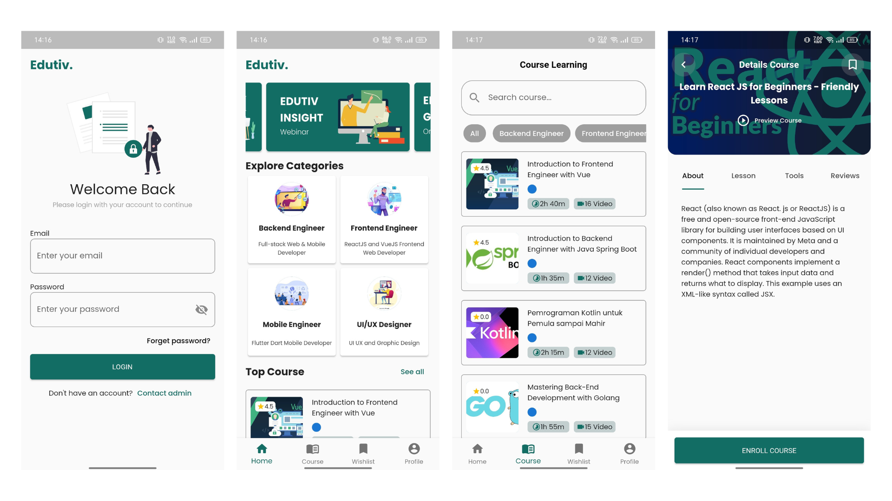
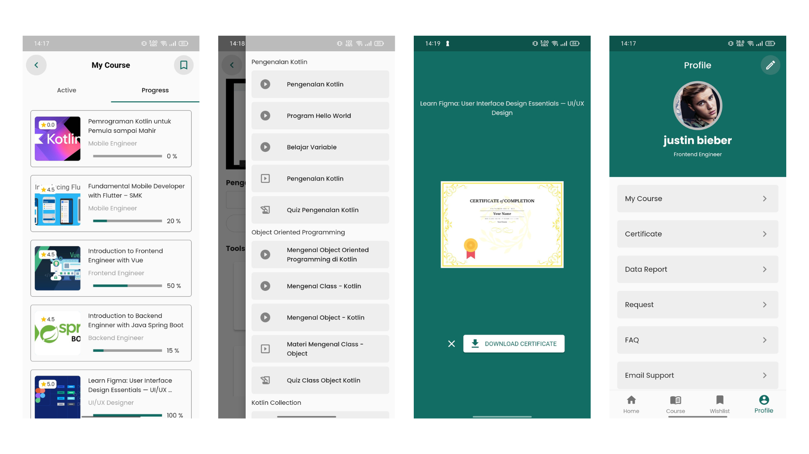

# Edutiv.

## About the Apps
Edutiv is an E-Learning, Learning Management System that we can learn Tech Related Courses by watching videos, materials from slides and quizes.

## Technologies
- [Flutter](https://docs.flutter.dev/get-started/install)
- [Dio](https://pub.dev/packages/dio)
- [Providers](https://pub.dev/packages/provider)
- [Flutter Youtube Player](https://pub.dev/packages/youtube_player_flutter)
- [Flutter Easy Loading](https://pub.dev/packages/flutter_easyloading)

## Screenshots

## Download the App
[Click Here To Download](https://drive.google.com/file/d/1QRoxSOueogAZGacMQ2ZokyU1umaqJYtH/view?usp=sharing)

## Demo Video
[Watch Here!](https://drive.google.com/file/d/1O4YV8IaC75hKMcwkwtX-fRmvoaZqc7wc/view?usp=sharing)